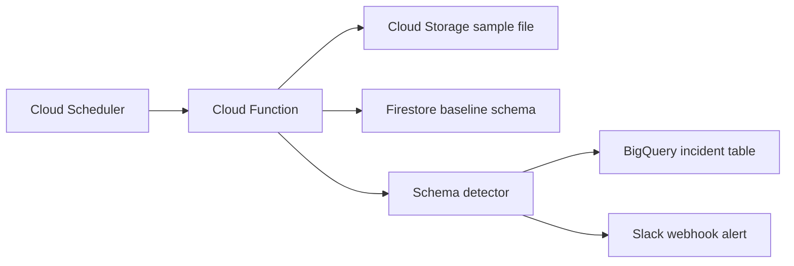

# DriftGuard


[](https://github.com/AYE5HA/DriftGuard/actions/workflows/ci.yml)
DriftGuard is an automated schema drift monitoring system for JSON and CSV files landing in Google Cloud Storage. It samples incoming files, infers the current schema, compares it with a Firestore baseline, logs anomalies to BigQuery, and sends a Slack alert before downstream analytics jobs break.

The project is intentionally small and readable. 

## The problem:
ETL pipelines feeding BigQuery break silently when upstream APIs or data sources change their schema — a column gets renamed, a field type changes, a new nested key appears. Engineers discover it when their Looker dashboard shows zeros or nulls at 2am. DriftGuard catches schema drift before it reaches your analytics layer, with severity-ranked alerts and a full incident log.

## No-Billing Local Demo

Google Cloud may require an active billing account to deploy Cloud Functions, Cloud Scheduler, and Cloud Storage resources. If you do not want to attach billing, you can still run the full drift detection workflow locally.

```bash
python local_demo.py
```

This local demo:

- loads the baseline schema from [config/sample_config.yaml](config/sample_config.yaml)
- reads [samples/events_drift.json](samples/events_drift.json)
- infers the incoming schema
- detects renamed columns, new columns, and datatype changes
- writes local outputs to `demo_output/`
- creates a Slack-style alert preview without sending anything externally

Example terminal output:

```text
DriftGuard local demo complete
Dataset: ecommerce_events
Anomalies: 3

Detected changes:
- [MEDIUM] renamed_column: Possible rename from user_id to userid with 92.3% similarity.
- [LOW] new_column: New column marketing_source was found in the incoming file.
- [HIGH] datatype_change: Column purchase_amount changed from float to string.
```

See [docs/demo_walkthrough.md](docs/demo_walkthrough.md) for a step-by-step walkthrough.

## Architecture



For more detail, see [docs/architecture.md](docs/architecture.md).

## What DriftGuard Detects

- Missing columns, marked `HIGH`
- Newly added columns, marked `LOW`
- Datatype changes, marked `HIGH`
- Likely renamed columns using fuzzy matching, marked `MEDIUM`

Rename detection uses `rapidfuzz` with a default similarity threshold of `80`. No embeddings, LLM APIs, or external ML services are used.

## Project Structure

```text
DriftGuard/
  cloud_function/
    main.py
    schema_detector.py
    semantic_matcher.py
    notifier.py
    bq_logger.py
    firestore_store.py
    requirements.txt
  bigquery/
    schema.json
  config/
    sample_config.yaml
  samples/
    events_baseline.json
    events_drift.json
    events.csv
  tests/
    test_schema_detector.py
    test_local_demo.py
  local_demo.py
  requirements.txt
  README.md
```

## Baseline Config

Baseline schemas are defined in YAML and registered into Firestore.

```yaml
dataset_name: ecommerce_events

file_path: gs://driftguard-data/events.json

similarity_threshold: 80

expected_schema:
  user_id: string
  event_type: string
  purchase_amount: float
  timestamp: timestamp
  user.email: string
```

Nested JSON keys are flattened with dot notation. For example, `{"user": {"id": 1}}` becomes `user.id`.

## Firestore Format

Collection: `driftguard_baselines`

Document ID: dataset name, for example `ecommerce_events`

```json
{
  "dataset_name": "ecommerce_events",
  "file_path": "gs://driftguard-data/events.json",
  "similarity_threshold": 80,
  "expected_schema": {
    "user_id": "string",
    "event_type": "string",
    "purchase_amount": "float",
    "timestamp": "timestamp",
    "user.email": "string"
  },
  "updated_at": "2026-05-18T09:30:00Z"
}
```

## BigQuery Incident Table

Create a table with the schema in [bigquery/schema.json](bigquery/schema.json).

Required columns:

- `timestamp`
- `dataset_name`
- `anomaly_type`
- `old_column`
- `new_column`
- `severity`
- `details`

## Setup

1. Create and activate a virtual environment.

```bash
python -m venv .venv
source .venv/bin/activate
```

On Windows PowerShell:

```powershell
python -m venv .venv
.\.venv\Scripts\Activate.ps1
```

2. Install dependencies.

```bash
pip install -r requirements.txt
```

3. Set your Google Cloud project.

```bash
gcloud config set project YOUR_PROJECT_ID
```

4. Enable required services.

```bash
gcloud services enable cloudfunctions.googleapis.com cloudscheduler.googleapis.com storage.googleapis.com firestore.googleapis.com bigquery.googleapis.com
```

## GCP Resources

Create a GCS bucket and upload a sample file.

```bash
gcloud storage buckets create gs://driftguard-data --location=us-central1
gcloud storage cp samples/events_baseline.json gs://driftguard-data/events.json
```

Create the BigQuery dataset and incident table.

```bash
bq mk --dataset YOUR_PROJECT_ID:driftguard
bq mk --table YOUR_PROJECT_ID:driftguard.schema_incidents bigquery/schema.json
```

Create Firestore in Native mode from the Google Cloud Console if your project does not already have Firestore enabled.

## Register Baseline Schema

For local registration, authenticate first:

```bash
gcloud auth application-default login
```

Then run:

```bash
cd cloud_function
CONFIG_PATH=../config/sample_config.yaml python main.py
```

On Windows PowerShell:

```powershell
cd cloud_function
$env:CONFIG_PATH="../config/sample_config.yaml"
python main.py
```

## Deploy Cloud Function

Detailed deployment notes are available in [docs/gcp_deployment_notes.md](docs/gcp_deployment_notes.md).

Deploy as an HTTP-triggered Python 3.11 Cloud Function.

```bash
gcloud functions deploy driftguard \
  --gen2 \
  --runtime=python311 \
  --region=us-central1 \
  --source=cloud_function \
  --entry-point=driftguard \
  --trigger-http \
  --allow-unauthenticated \
  --set-env-vars=BASELINE_COLLECTION=driftguard_baselines,BQ_TABLE_ID=YOUR_PROJECT_ID.driftguard.schema_incidents,SLACK_WEBHOOK_URL=YOUR_SLACK_WEBHOOK_URL
```

For a private production deployment, remove `--allow-unauthenticated` and call the function with an authenticated Scheduler job.

## Schedule Detection

Replace `FUNCTION_URL` with the deployed Cloud Function URL.

```bash
gcloud scheduler jobs create http driftguard-ecommerce-events \
  --location=us-central1 \
  --schedule="*/5 * * * *" \
  --uri="FUNCTION_URL?dataset_name=ecommerce_events" \
  --http-method=GET
```

## Slack Webhook Setup

1. Create a Slack app at `https://api.slack.com/apps`.
2. Enable Incoming Webhooks.
3. Add a webhook for the target channel.
4. Store the webhook URL as the `SLACK_WEBHOOK_URL` Cloud Function environment variable.

Example alert:

```text
DriftGuard detected schema drift
Dataset: ecommerce_events
Summary: 1 datatype change, 1 new column, 1 renamed column
Detected changes:
- [MEDIUM] renamed_column: user_id -> userid
- [HIGH] datatype_change: purchase_amount
- [LOW] new_column: marketing_source
```

## Example Output

When `samples/events_drift.json` is compared against the sample baseline, DriftGuard reports:

```json
[
  {
    "dataset_name": "ecommerce_events",
    "anomaly_type": "renamed_column",
    "old_column": "user_id",
    "new_column": "userid",
    "severity": "MEDIUM"
  },
  {
    "dataset_name": "ecommerce_events",
    "anomaly_type": "new_column",
    "new_column": "marketing_source",
    "severity": "LOW"
  },
  {
    "dataset_name": "ecommerce_events",
    "anomaly_type": "datatype_change",
    "old_column": "purchase_amount",
    "new_column": "purchase_amount",
    "severity": "HIGH"
  }
]
```

## Local Tests

Run the lightweight unit tests:

```bash
python -m pytest tests
```

## Future Improvements

- sentence-transformer embeddings for stronger rename detection
- UI dashboard for incident browsing
- dbt integration
- Pub/Sub support
- schema version history
- automated rollback suggestions
