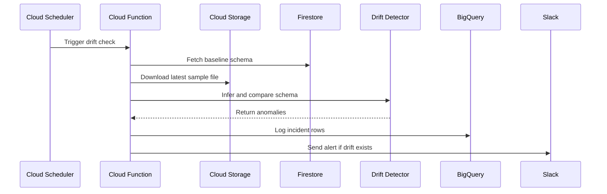

# DriftGuard Architecture

DriftGuard is designed as a small, production-style data engineering project for detecting schema drift before ETL pipelines break.

## Production Flow

## Main Components

- `cloud_function/main.py`: HTTP entry point for Cloud Scheduler.
- `cloud_function/schema_detector.py`: JSON/CSV schema inference and anomaly comparison.
- `cloud_function/semantic_matcher.py`: fuzzy rename detection using `rapidfuzz`.
- `cloud_function/firestore_store.py`: baseline schema registration and lookup.
- `cloud_function/bq_logger.py`: BigQuery incident logging.
- `cloud_function/notifier.py`: Slack alert delivery.
- `local_demo.py`: no-billing version of the same workflow for local review.

## Why This Project Matters

Schema drift is a common cause of downstream analytics failure. A renamed column, missing field, or unexpected datatype can break dashboards, dbt models, and reporting jobs.

DriftGuard catches these changes early by checking incoming files before they reach downstream analytics systems.

## Design Choices

- YAML baselines keep schema registration beginner-friendly.
- Firestore is used as a simple serverless metadata store.
- BigQuery stores anomaly logs in an analytics-friendly format.
- Slack alerts make issues visible quickly.
- Local demo mode makes the project reviewable without paid cloud resources.

## Supported Drift Types

| Drift type | Example | Severity |
| --- | --- | --- |
| Missing column | `purchase_amount` removed | `HIGH` |
| New column | `marketing_source` added | `LOW` |
| Datatype change | `float` to `string` | `HIGH` |
| Likely rename | `user_id` to `userid` | `MEDIUM` |

